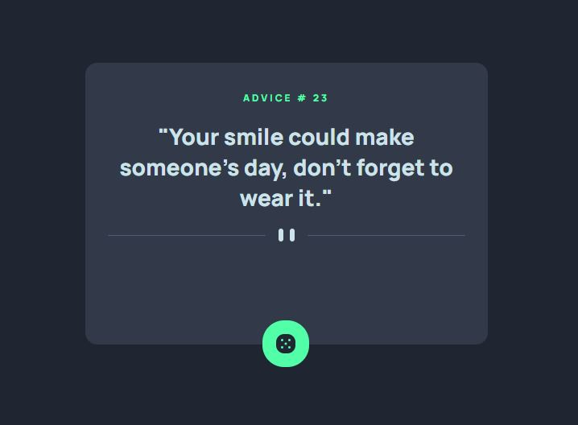

# Frontend Mentor - Advice generator app solution

This is a solution to the [Advice generator app challenge on Frontend Mentor](https://www.frontendmentor.io/challenges/advice-generator-app-QdUG-13db). Frontend Mentor challenges help you improve your coding skills by building realistic projects.

## Table of contents

- [Overview](#overview)
  - [The challenge](#the-challenge)
  - [Screenshot](#screenshot)
  - [Links](#links)
- [My process](#my-process)
  - [Built with](#built-with)
  - [What I learned](#what-i-learned)
  - [Continued development](#continued-development)
- [Author](#author)

## Overview

### The challenge

Users should be able to:

- View the optimal layout for the app depending on their device's screen size
- See hover states for all interactive elements on the page
- Generate a new piece of advice by clicking the dice icon

### Screenshot



### Links

- Solution URL: [Add solution URL here](https://github.com/N-Ignacio-Bouffanais/advice-generator-app)
- Live Site URL: [Add live site URL here](https://n-ignacio-bouffanais.github.io/advice-generator-app/)

## My process

### Built with

- Semantic HTML5 markup
- CSS custom properties
- CSS Grid

### What I learned

```html
<h1>ADVICE # <span id="id"></span></h1>
<p>"<span id="quote"></span>"</p>
```
```js
const sendGetRequest = async () => {
    try {
        const resp = await axios.get('https://api.adviceslip.com/advice');
        document.getElementById("id").innerHTML = resp.data.slip.id;
        document.getElementById("quote").innerHTML = resp.data.slip.advice;
    } catch (err) {
        console.error(err);
    }
};
sendGetRequest();
```

### Continued development
I want to continue learning and making projects with javascript, css and html, and over time add tools like Eslint, reactjs, nextjs, sass, among others.

## Author

- Website - [Nicolas_Bouffanais](https://n-ignacio-bouffanais.github.io/Nicolas_Bouffanais/src/)
- Frontend Mentor - [@N-Ignacio-Bouffanais](https://www.frontendmentor.io/profile/N-Ignacio-Bouffanais)
- Twitter - [@N_Bouffanais](https://twitter.com/N_Bouffanais)
